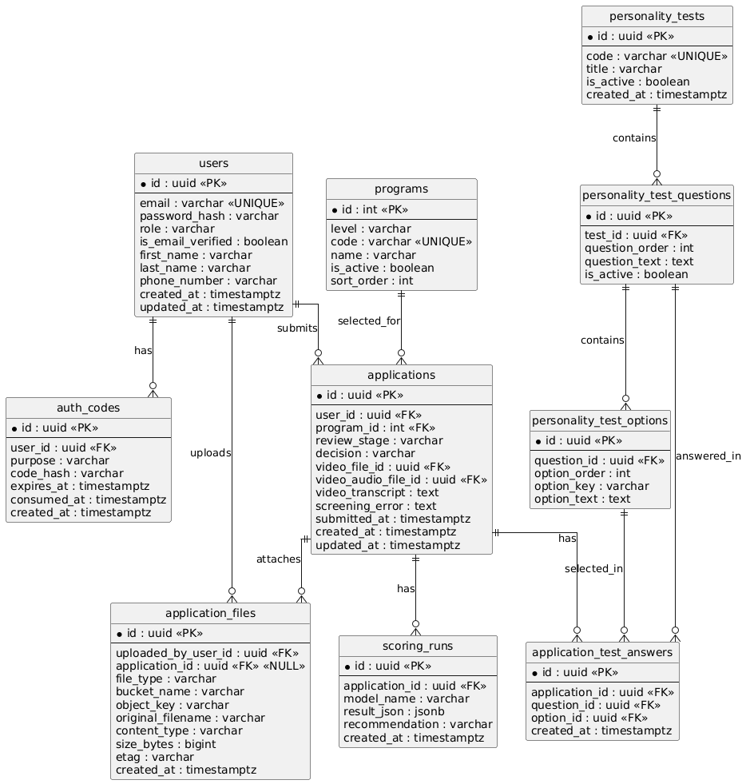

# Architecture

## Architecture Diagram

## ERD (Entity Relationship Diagram)



---

```plantuml

hide circle
skinparam linetype ortho

entity "users" as users {
  *id : uuid <<PK>>
  --
  email : varchar <<UNIQUE>>
  password_hash : varchar
  role : varchar
  is_email_verified : boolean
  first_name : varchar
  last_name : varchar
  phone_number : varchar
  created_at : timestamptz
  updated_at : timestamptz
}

entity "auth_codes" as auth_codes {
  *id : uuid <<PK>>
  --
  user_id : uuid <<FK>>
  purpose : varchar
  code_hash : varchar
  expires_at : timestamptz
  consumed_at : timestamptz
  created_at : timestamptz
}

entity "programs" as programs {
  *id : int <<PK>>
  --
  level : varchar
  code : varchar <<UNIQUE>>
  name : varchar
  is_active : boolean
  sort_order : int
}

entity "applications" as applications {
  *id : uuid <<PK>>
  --
  user_id : uuid <<FK>>
  program_id : int <<FK>>
  review_stage : varchar
  decision : varchar
  video_file_id : uuid <<FK>>
  video_audio_file_id : uuid <<FK>>
  video_transcript : text
  screening_error : text
  submitted_at : timestamptz
  created_at : timestamptz
  updated_at : timestamptz
}

entity "application_files" as application_files {
  *id : uuid <<PK>>
  --
  uploaded_by_user_id : uuid <<FK>>
  application_id : uuid <<FK>> <<NULL>>
  file_type : varchar
  bucket_name : varchar
  object_key : varchar
  original_filename : varchar
  content_type : varchar
  size_bytes : bigint
  etag : varchar
  created_at : timestamptz
}

entity "personality_tests" as personality_tests {
  *id : uuid <<PK>>
  --
  code : varchar <<UNIQUE>>
  title : varchar
  is_active : boolean
  created_at : timestamptz
}

entity "personality_test_questions" as pt_questions {
  *id : uuid <<PK>>
  --
  test_id : uuid <<FK>>
  question_order : int
  question_text : text
  is_active : boolean
}

entity "personality_test_options" as pt_options {
  *id : uuid <<PK>>
  --
  question_id : uuid <<FK>>
  option_order : int
  option_key : varchar
  option_text : text
}

entity "application_test_answers" as app_test_answers {
  *id : uuid <<PK>>
  --
  application_id : uuid <<FK>>
  question_id : uuid <<FK>>
  option_id : uuid <<FK>>
  created_at : timestamptz
}

entity "scoring_runs" as scoring_runs {
  *id : uuid <<PK>>
  --
  application_id : uuid <<FK>>
  model_name : varchar
  result_json : jsonb
  recommendation : varchar
  created_at : timestamptz
}

users ||--o{ auth_codes : has
users ||--o{ applications : submits
users ||--o{ application_files : uploads

programs ||--o{ applications : selected_for

applications ||--o{ application_files : attaches
applications ||--o{ app_test_answers : has
applications ||--o{ scoring_runs : has

personality_tests ||--o{ pt_questions : contains
pt_questions ||--o{ pt_options : contains
pt_questions ||--o{ app_test_answers : answered_in
pt_options ||--o{ app_test_answers : selected_in
```

## System Flow

Frontend:

- Application Page (Студент/Школьник кидает свою заявку)
- Admin Panel (Админка Приемной Комиссий)

Backend (Golang):

POST /applications (для фронтенд страницы Оставление заявки)

операционные данные:

required:
Имя, Фамилия
Телефон Номер
Программа

Программа:

1) Undergraduate
    - Society (Sociology: Leadership and Innovation)
    - Art + Media (Digital Media and Marketing)
    - Tech (Innovative IT Product Design and Development)
    - Policy Reform (Public Policy and Developmen)
    - Engineering (Creative Engineering)
2) Foundation Year

оценочные:

Required Fields:
- Video (Personal Presentation) (format: mp4)

Optional Fields:
- Test (Personality test) (40 вопросов из Вебсайта)
- Portfolio (format: PDF) (for Undergraduate Program)
- English proficiency results (format: PDF)
- Certificates (format: PDF)

Мы храним MP4 и PDF в Minio S3.

Он должен отправлять запрос на Speech-to-text Whisper Service (API Endpoint),
получать Video Transcription.

После получения Video Transcription делаем запрос на сервис LLM Scoring (API Endpoint), получаем json output ответ, и сохраняем его в Таблицу LLM_Scoring.

GET /candidates (список всех Кандидатов который оставили заявку)

GET /candidates/user_id (данные одного Кандидата)

Tables:

Users (Id, Имя, Фамилия, Phone number)

Applications (id, user_id, video, (also Video Transcription) and other оценочные fields, status (статус кандидата из stages))

LLM_Scoring (id, user_id, json output of LLM Scoring service)

---

LLM Scoring (Python and FastAPI webserver)

input:

Video Transcription

output scoring engine:
```plantuml

json
{
    "answer": {
        "motivation": {
            "subscores": {
                "university_specificity": 2,
                "program_fit": 2,
                "goal_alignment": 2,
                "intrinsic_motivation": 1,
                "specificity_of_reasoning": 1
            },
            "evidence": [
                {
                    "subscore": "university_specificity",
                    "quote": "I think it is a good university and it gives many opportunities... I heard that this university is modern and focuses on technology, which is important in today\u2019s world.",
                    "reason": "Provides only generic praise and a broad statement about modern focus; lacks concrete details about inVision U."
                },
                {
                    "subscore": "program_fit",
                    "quote": "I am interested in IT program because IT is popular and \u043f\u0435\u0440\u0441\u043f\u0435\u043a\u0442\u0438\u0432\u043d\u043e\u0435 \u043d\u0430\u043f\u0440\u0430\u0432\u043b\u0435\u043d\u0438\u0435. I like computers and I want to work in this field in the future.",
                    "reason": "Shows general interest in IT but does not connect personal background or specific skills to the program."
                },
                {
                    "subscore": "goal_alignment",
                    "quote": "My long-term goal is to have a successful career and work in a good company... This program will help me because it gives knowledge and skills.",
                    "reason": "States a generic career goal and a vague link to the program without concrete alignment."
                },
                {
                    "subscore": "intrinsic_motivation",
                    "quote": "I want to develop myself and get a good education. I want to earn money and help my family.",
                    "reason": "Motivation is expressed mainly in terms of external outcomes (education, money, family support) with little evidence of internal drive or values."
                },
                {
                    "subscore": "specificity_of_reasoning",
                    "quote": "I think it is a good university... IT is popular... This program will help me because it gives knowledge and skills.",
                    "reason": "Reasoning is generic and lacks concrete, detailed justification."
                }
            ],
            "weaknesses": [
                "Very generic reasons for choosing inVision U and the IT program.",
                "Limited articulation of personal values or deep internal motivation.",
                "Lack of concrete examples linking program content to long\u2011term career plan."
            ]
        },
        "leadership_potential": {
            "subscores": {
                "leadership_definition_quality": 1,
                "concrete_example_presence": 2,
                "initiative": 1,
                "responsibility": 1,
                "impact": 1,
                "reflection": 0
            },
            "evidence": [
                {
                    "subscore": "leadership_definition_quality",
                    "quote": "For me, a leader is a person who leads others and is responsible.",
                    "reason": "Definition is simplistic and does not demonstrate depth or maturity."
                },
                {
                    "subscore": "concrete_example_presence",
                    "quote": "Sometimes I helped my classmates with homework, so I think it is also leadership.",
                    "reason": "Provides a real but minimal example of helping peers."
                },
                {
                    "subscore": "initiative",
                    "quote": "Sometimes I helped my classmates with homework...",
                    "reason": "No clear indication that the candidate initiated the assistance; could be reactive."
                },
                {
                    "subscore": "responsibility",
                    "quote": "I helped my classmates with homework.",
                    "reason": "Shows some assistance but does not convey ownership of a larger task or decision\u2011making."
                },
                {
                    "subscore": "impact",
                    "quote": "I helped my classmates with homework.",
                    "reason": "Impact is limited to individual classmates; no evidence of broader influence."
                }
            ],
            "weaknesses": [
                "Leadership definition lacks nuance.",
                "Example is minor and does not illustrate significant initiative or impact.",
                "No reflection on what was learned from the leadership experience."
            ]
        },
        "response_structure": {
            "subscores": {
                "clarity": 4,
                "coherence": 3,
                "completeness": 3,
                "relevance": 4,
                "conciseness": 4
            },
            "evidence": [
                {
                    "subscore": "clarity",
                    "quote": "Hi, my name is Daniyar. I want to apply to inVision U because I think it is a good university...",
                    "reason": "Sentences are clear and easily understood."
                },
                {
                    "subscore": "coherence",
                    "quote": "The response follows a logical order: motivation, program choice, challenge, goals, leadership view, family support.",
                    "reason": "Ideas are presented in a sensible sequence, though transitions are simple."
                },
                {
                    "subscore": "completeness",
                    "quote": "Addresses why applying, program interest, a challenge, long\u2011term goal, definition of leader, example, and family support.",
                    "reason": "All required prompts are touched, but depth is limited for several questions."
                },
                {
                    "subscore": "relevance",
                    "quote": "Each paragraph directly answers one of the asked questions.",
                    "reason": "Content stays on topic throughout."
                },
                {
                    "subscore": "conciseness",
                    "quote": "The answer is brief and does not contain unnecessary repetition.",
                    "reason": "Responses are short and to the point."
                }
            ],
            "weaknesses": [
                "Limited depth makes some answers feel superficial.",
                "Missing explicit statement of personal motivations beyond generic goals."
            ]
        },
        "context_notes": {
            "family_support_context": "My family supports me and wants me to study in a good university. My parents always tell me to study well and have a good future.",
            "encouragement_source": "Parents are the biggest source of encouragement."
        },
        "risk_flags": [],
        "missing_evidence": [
            "Explicit articulation of personal intrinsic motivations beyond earning money and helping family.",
            "Detailed reflection on what was learned from the leadership example."
        ]
    },
    "model": "openai/gpt-oss-120b"
}

```
---

Whisper (Python FastAPI webserver)

---
