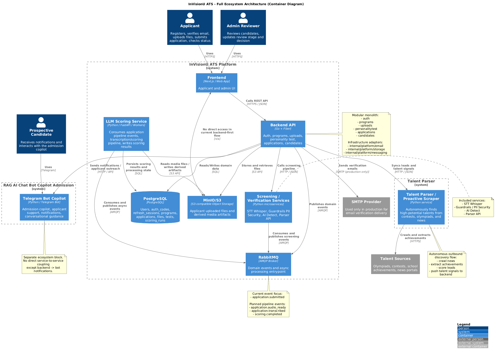
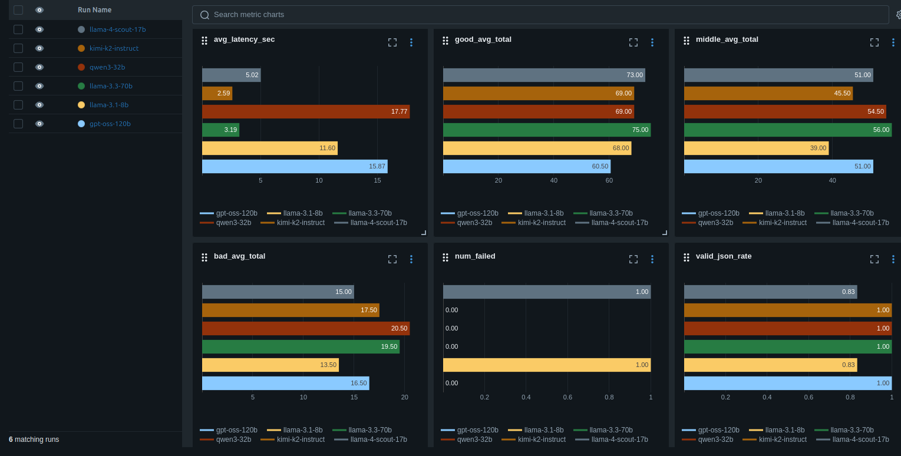
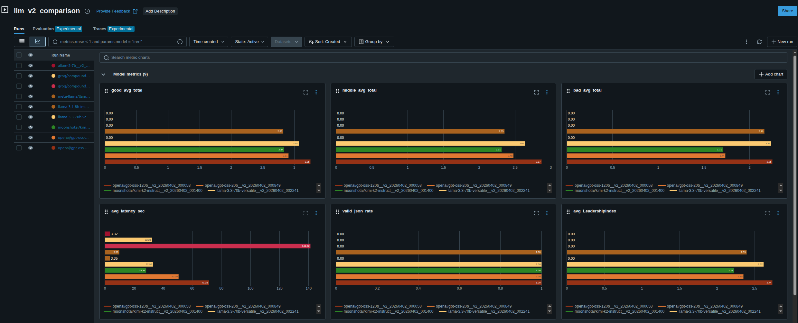
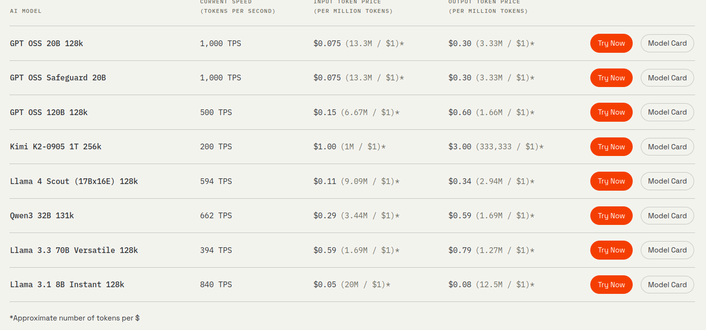
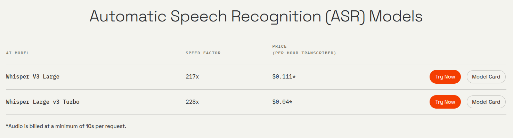
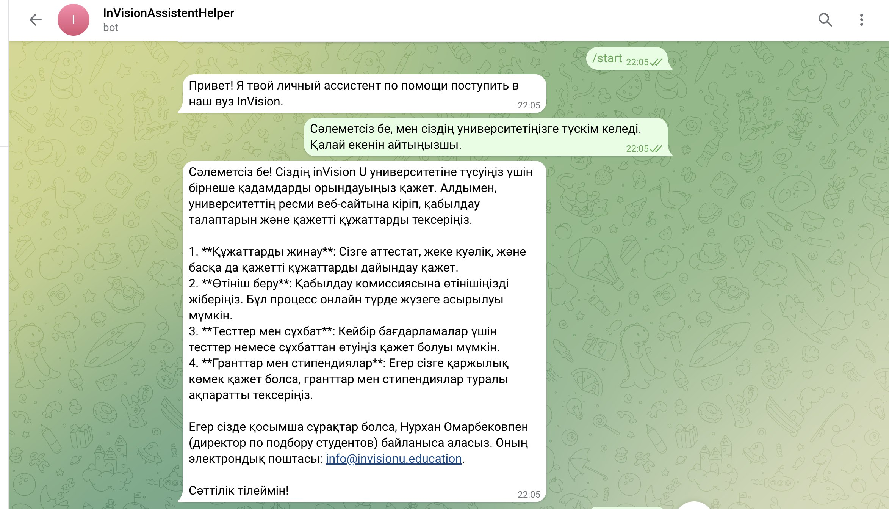
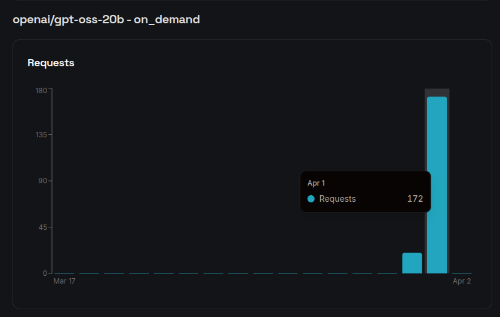
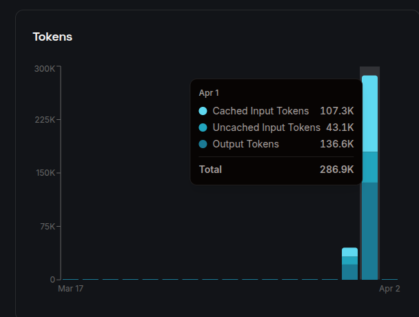
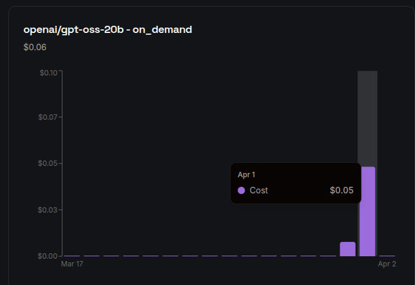
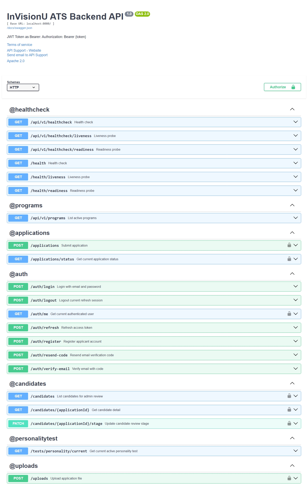

# InvisionU ATS — Intelligent Candidate Selection Support System

AI-платформа для приёмной комиссии inVision U: система анализирует данные кандидатов, оценивает лидерский потенциал, формирует объяснимый score для более качественного отбора.
В нашем решении мы использовали провайдера Groq для моделей STT + LLM Ranking и OpenAI для RAG телеграм бота, также [здесь](https://github.com/agentic-lab-club/invisionu-ats-decentrathon-2026/tree/local_llm) вы можете посмотреть реализацию на локальных моделях.

---

## Содержание

- [Quickstart](#quickstart)
- [Роли и Доступ](#роли-и-доступ)
- [О проекте](#о-проекте)
- [Безопасность данных пользователей](#безопасность-данных-пользователей)
- [Технические требования кейса](#технические-требования-кейса)
- [Ключевая ценность решения](#ключевая-ценность-решения)
- [Архитектура](#архитектура)
- [Сервисы монорепозитория](#сервисы-монорепозитория)
- [Подход к скорингу](#подход-к-скорингу)
- [Эволюция LLM scoring (V1 → V2)](#эволюция-llm-scoring-v1--v2)
- [Стоимость API-решения](#стоимость-api-решения)
- [Демо](#демо)
- [Исследовательская база](#исследовательская-база)

---

## Quickstart

### Локальный запуск

1. Заполните корневой `.env` по примеру `.env.example`.
2. Также заполните `backend/config/config.prod.yaml` по примеру `backend/config/config.example.yaml` и вашего `.env`.
3. Поднимите ATS стек:

```bash
docker compose up -d --build
```

4. Поднимите RAG бот отдельно, если он нужен локально:

```bash
docker compose -f docker-compose.bot.yml up -d --build
```

также нужно прописать комманду (индексацию данных сайта в Chroma):
```bash
curl -X POST http://localhost:8000/ingest \
  -H 'Content-Type: application/json' \
  -d '{
    "start_url": "https://www.invisionu.education/ru",
    "max_pages": 30,
    "max_depth": 2,
    "request_timeout": 10,
    "restrict_to_start_path": false
  }'
```

5. Поднимите scraper отдельно, если он нужен локально:

```bash
docker compose -f docker-compose.scraper.yml up -d --build
```

### Быстрый AWS деплой

**Подробная информация здесь:** [`infrastructure/README.md`](infrastructure/README.md)

1. Перейдите в [`infrastructure/`](infrastructure/README.md) и создайте `terraform.tfvars` из `infrastructure/terraform/envs/dev/terraform.tfvars.example`.
2. Примените Terraform из `infrastructure/terraform/envs/dev`.
3. Запишите в AWS Secrets Manager два секрета:
   - содержимое корневого `.env.prod`
   - содержимое `backend/config/config.prod.yaml`
4. На EC2-контейнерном хосте клонируйте репозиторий и запустите:

```bash
export AWS_REGION="your-region"
export COMPOSE_ENV_SECRET_NAME="invisionu/dev/.env.prod"
export BACKEND_CONFIG_SECRET_NAME="invisionu/dev/backend/config.prod.yaml"
./infrastructure/scripts/deploy_compose.sh
```

5. Заберите `frontend_cloudfront_url` из Terraform outputs. Это и будет generic CloudFront URL для фронтенда.

---

## Роли И Доступ

В системе предусмотрены 2 роли:

- `Applicant` — абитуриент, который проходит этапы поступления, тестирование и интервью.
- `Admin` — роль приёмной комиссии, которая просматривает кандидатов, аналитику и принимает решения.

Прод-frontend доступен по ссылке:

- https://d1fwa62fmryv66.cloudfront.net/

Тестовый `admin` пользователь для приёмной комиссии:

```sql
'admin@gmail.com',                 -- email нового пользователя
crypt('TestPassword123', gen_salt('bf')),  -- хешированный пароль
```

## О проекте

InvisionU ATS объединяет несколько модулей в единый процесс оценки кандидата:

1. Кандидат проходит SJT-тест и видеоинтервью.
2. STT-модуль преобразует речь видеоинтервью в текст.
3. LLM scoring оценивает ответы по поведенческим критериям.
4. Система объединяет SJT + LLM в единый финальный score.
5. Комиссия работает в ATS-панели с фильтрами и аналитикой.

Используемые провайдеры:
- **Groq** — STT + LLM ranking.
- **OpenAI** — RAG-бот (Telegram).

## Безопасность данных пользователей

Чтобы минимизировать риск утечки персональных данных через внешних API-провайдеров, мы подготовили отдельную ветку с локальным инференсом моделей:
- local_llm: https://github.com/agentic-lab-club/invisionu-ats-decentrathon-2026/tree/local_llm

В ветке **local_llm** обезличивание данных не используется, поскольку обработка выполняется локально и данные остаются внутри инфраструктуры команды.

Для ветки **main** (API-архитектура с внешними провайдерами) рекомендуется обязательное обезличивание персональных данных перед отправкой в LLM/STT.
Для этого необходимо использовать **Microsoft Presidio**.

## Технические требования кейса

- ТЗ (RUS): [/docs/Задача AI inDrive inVision U РУС - Decentrathon 5.0.pdf](/docs/Задача%20AI%20inDrive%20inVision%20U%20РУС%20-%20Decentrathon%205.0.pdf)
- Technical Requirement (ENG): [/docs/Case AI inDrive inVision U ENG - Decentrathon 5.0.pdf](/docs/Case%20AI%20inDrive%20invision%20U%20ENG%20-%20Decentrathon%205.0.pdf)

---

## Ключевая ценность решения

- **Объяснимость:** финальный балл прозрачно раскладывается по осям M/P/R/L/V.
- **Снижение субъективности:** структурированный SJT + стандартизированный LLM анализ.
- **Масштабируемость:** микросервисная архитектура (frontend, backend, scoring, STT, RAG).
- **Экономичность:** очень низкая стоимость анализа одной анкеты.

---

## Архитектура

Подробности: [ARCHITECTURE.md](ARCHITECTURE.md)

### C4 Container Diagram



### ERD (Backend/PostgreSQL)


---

## Сервисы монорепозитория

| Модуль | Назначение | Технологии |
|---|---|---|
| `frontend/` | ATS-интерфейс для кандидатов и комиссии | Next.js, React |
| `backend/` | Core API, бизнес-логика, оркестрация микросервисов | Go, PostgreSQL |
| `llm/` | Интервью-скоринг и извлечение поведенческих признаков | Python, FastAPI, LLM |
| `STT/` | Транскрибация аудио/видео интервью | Whisper |
| `tg_bot_rag/` | Телеграм-бот с retrieval-поиском | Python, Aiogram, RAG |
| `infrastructure/` | IaC и облачная инфраструктура | Terraform, DevOps stack |
| `AI_Detecter-service/` | Детекция AI-сгенерированного текста | Python, FastAPI, Transformers, PyTorch |
| `TalantParser/` | Агрегатор и парсер новостей о победах школьников/студентов | Python, FastAPI, httpx, Playwright |
| `parser/` | Извлечение `ENT` / `IELTS` score из PDF | Python, FastAPI |

---

## Подход к скорингу

Наша модель подсчета объединяет два независимых потока данных: **оценку транскрипции видеоинтервью (Verbal Features)** и **SJT-алгоритмику (Situational Judgment Test)**.

> **Зачем нужен тест (SJT)?**  
> Тестирование позволяет стандартизировать оценку лидерского потенциала, делая ее более надежной и объяснимой по сравнению с классическими эссе или неструктурированными интервью. Исследования [\[1\]](https://doi.org/10.1007/s11934-022-01115-8), [\[2\]](https://psycnet.apa.org/fulltext/2024-74447-001.html) показывают, что традиционные методы часто подвержены субъективности (bias), влиянию коучинга и плагиата. В то же время психологические опросники и SJT гораздо точнее измеряют non-cognitive навыки — ответственность, умение работать в команде и ценностные ориентации — в формате, который можно объективно валидировать.

> **Почему мы фокусируемся на анализе текста (Verbal Features)?**  
> При машинном анализе видеоинтервью критически важно, чтобы задаваемые вопросы провоцировали кандидатов на проявление конкретных личностных черт (trait-relevant). Исследования доказывают, что именно текстовые (verbal) признаки несут наибольшую информативность и объяснимость по сравнению с чисто визуальными (visual) или звуковыми (audio) данными [\[4\]](https://link.springer.com/article/10.1007/s12193-012-0101-0).
>
> Более того, в исследовании [\[9\]](https://www.sciencedirect.com/science/article/pii/S074756322300479X) суммарная мультимодальная модель (text + audio + video) объясняла `R² = 0.44` успешности интервью. Однако львиную долю этой дисперсии закрывали именно текстовые фичи (`R² = 0.38`), тогда как аудио (`R² = 0.33`) и визуальные признаки (`R² = 0.19`) давали либо минимальный, либо нулевой прирост.

> *«The verbal modality explained almost all of the variance of observer-reported personality traits and interview performance, and adding audio and visual features lead to small (or no) increase of the total explained variance.»* [\[9\]](https://www.sciencedirect.com/science/article/pii/S074756322300479X) 

### Оси оценки

- **M** (Motivation) — уровень внутренней мотивации и стремление к достижению целей;
- **P** (Planning) — навык стратегического планирования будущего и целеполагания;
- **R** (Resilience) — стрессоустойчивость и адаптивность в нестандартных или сложных ситуациях;
- **L** (Leadership) — способность вести за собой, управлять групповой динамикой и выстраивать стратегии;
- **V** (Values) — соответствие корпоративным и этическим ценностям (включая фактор «Honesty-Humility» — честность и скромность).


### Тест (SJT — Situational Judgment Test)

Система подсчета результатов ситуационного тестирования (SJT) базируется на накоплении баллов по пяти ключевым осям, отражающим лидерский потенциал и поведенческие характеристики кандидата.
Каждый ответ на один из 40 вопросов теста имеет определенный вес для каждой из представленных осей(посмотреть разбаловку [теста](docs/Questions_and_Scoring_Reference.md#question-option-metrics) ). После прохождения тестирования вычисляется «сырой» балл (сумма весов выбранных ответов). Затем он нормализуется по шкале от 0 до 100 на основе максимально возможных баллов для каждого вопроса. Полученные результаты интегрируются с оценками от LLM-модели (на основе транскрипции интервью) для формирования итогового рейтинга кандидата. 

Общий балл рассчитывается по формуле:

```math
Final\_Score = \omega_M \cdot M + \omega_P \cdot P + \omega_R \cdot R + \omega_L \cdot L + \omega_V \cdot V
```

Где веса $\omega$ задаются в процентах и адаптируются в зависимости от выбранных фильтров вакансии. Подробнее: [Режимы финального ранжирования](docs/Questions_and_Scoring_Reference.md#final-ranking-modes).

При доработке вопросов и алгоритмов скоринга мы опирались на следующие академические исследования:
1. [Evaluating the Whole Applicant: Use of Situational Judgment Testing and Personality Testing to Address Disparities in Resident Selection](https://doi.org/10.1007/s11934-022-01115-8)
2. [Personality and Leadership: Meta-Analytic Review of Cross-Cultural Moderation, Behavioral Mediation, and Honesty-Humility](https://psycnet.apa.org/fulltext/2024-74447-001.html)
3. [A Nonverbal Behavior Approach to Identify Emergent Leaders in Small Groups](https://www.researchgate.net/publication/312996139_A_Nonverbal_Behavior_Approach_to_Identify_Emergent_Leaders_in_Small_Groups)

### Fusion Score по осям

Финальный рейтинг кандидата формируется путем слияния нормализованных результатов ситуационного теста (SJT) и LLM-оценки транскрипции интервью для каждой из пяти осей (M, P, R, L, V).
Поскольку LLM оценивает навыки по шкале от 1 до 4, её результат умножается на 25 для приведения к общей 100-балльной шкале.

Для большинства осей (M, P, R, L) вес LLM-оценки (анализ прямой речи кандидата и реальных поведенческих примеров) составляет 55%, а вес теста (ответы на стандартизированные ситуации) — 45%, так как прямая речь обладает большей прогностической валидностью. Исключением является ось ценностей V (Values / Honesty-Humility), где вес теста выше (55%), поскольку структурированные психологические опросники исторически лучше выявляют этические установки.

Формулы слияния по каждой оси выглядят следующим образом:

- **M**: $0.45 \cdot Test_M + 0.55 \cdot (LLM_M \cdot 25)$
- **P**: $0.45 \cdot Test_P + 0.55 \cdot (LLM_P \cdot 25)$
- **R**: $0.45 \cdot Test_R + 0.55 \cdot (LLM_R \cdot 25)$
- **L**: $0.45 \cdot Test_L + 0.55 \cdot (LLM_L \cdot 25)$
- **V**: $0.55 \cdot Test_V + 0.45 \cdot (LLM_V \cdot 25)$

### Финальный балл кандидата

$$
Final\_Score = \omega_M \cdot M + \omega_P \cdot P + \omega_R \cdot R + \omega_L \cdot L + \omega_V \cdot V
$$

Где веса $\omega$ адаптируются режимом ранжирования (smart filters).
См. [Questions_and_Scoring_Reference.md](docs/Questions_and_Scoring_Reference.md#final-ranking-modes).

---

## Эволюция LLM scoring (V1 → V2)

## V1
```text
   STT 
    ↓
Общий промпт
    ↓
   Json
```


В версии V1 применялось оценочное решение на основе одного общего промпта. Из-за этого использование более легких моделей (< 70B) могло приводить к меньшей точности и большему разбросу при оценивании «сложных» кандидатов (например, красноречивых, но не приводящих реальных примеров, в противовес стеснительным, но целеустремленным кандидатам с лидерскими качествами).



## V2
```text
   STT 
    ↓
LLM-парсер по вопросам
    ↓
Анализ каждого вопроса отдельным персонализированным промптом
    ↓
Подсчёт баллов по каждой категории
    ↓
   JSON
```
Во второй версии стабильность модели значительно возросла за счет персонализации. Разница в оценивании между разными LLM-моделями теперь сводится лишь к их внутреннему смещению (bias), что гарантирует более объективное и точное сравнение кандидатов между собой. 

Кроме того, мы перешли от 100-балльной системы оценки к жестко заданной 4-балльной шкале (1-4). Это позволило исключить приблизительные результаты (если в V1 модель могла колебаться и ставить одному и тому же кандидату от 70 до 80 баллов, то в V2 каждый балл определен детерминированно). В промпте теперь четко прописаны критерии для выставления каждой конкретной оценки. Пример промпта: [Prompt](llm/prompts/q5_prompt.txt) 






---

### Speech-To-Text (STT)

Для транскрибации аудио из видеоответов кандидатов мы используем модель **Whisper (`whisper-large-v3-turbo`)**. 
Эта модель обеспечивает высокоточное распознавание текста, устойчива к фоновому шуму, сильным акцентам и грамматическим ошибкам в речи. Это критически важно, поскольку последующее оценивание LLM фокусируется на смысловом содержании ответа кандидата, а не на безупречности его английского языка или произношения.

Мы также провели сравнение с более тяжелой моделью `whisper-large-v3`. Поскольку качество транскрибации в наших тестах отличалось незначительно, мы сделали выбор в пользу `turbo`-версии как более оптимальной с точки зрения соотношения скорости и стоимости обработки.



---

### Telegram Bot (RAG-based University Admission AI Chatbot)

- **Телеграм-бот для приёмной комиссии**: который отвечает на вопросы о процессе поступления, требованиях и т.д., используя RAG (Retrieval-Augmented Generation) для получения актуальной информации из базы знаний.
- Поток работы:
  1. Пользователь задает вопрос в Telegram.
  2. Бот отправляет запрос в нашу систему.
  3. Наша система извлекает релевантные документы из ChromaDB и формирует ответ с помощью LLM.
  4. Бот возвращает ответ пользователю в Telegram.



---

## Стоимость API-решения

- 7 API-запросов на кандидата
- ~11.7K токенов на кандидата
- **$0.002** за полный анализ кандидата
- **$1 ≈ 500** обработанных заявок

 



---

## Демо

### Frontend (ATS Panel)

Роли:
- **Client** — подача заявки, прохождение теста, загрузка/запись интервью.
- **Moderator** — фильтрация кандидатов, анализ карточек, работа со shortlist.


### Backend API (Swagger)



---

## Исследовательская база

1. [Evaluating the Whole Applicant: Use of Situational Judgment Testing and Personality Testing to Address Disparities in Resident Selection](https://doi.org/10.1007/s11934-022-01115-8)
2. [Personality and Leadership: Meta-Analytic Review of Cross-Cultural Moderation, Behavioral Mediation, and Honesty-Humility](https://psycnet.apa.org/fulltext/2024-74447-001.html)
3. [A Nonverbal Behavior Approach to Identify Emergent Leaders in Small Groups](https://www.researchgate.net/publication/312996139_A_Nonverbal_Behavior_Approach_to_Identify_Emergent_Leaders_in_Small_Groups)
4. [Emergent leaders through looking and speaking: from audio-visual data to multimodal recognition](https://link.springer.com/article/10.1007/s12193-012-0101-0)
5. [Emotional intelligence, leadership, and work teams: A hybrid literature review](https://doi.org/10.1016/j.heliyon.2023.e20356)
6. [Personality and Leadership: A Qualitative and Quantitative Review](https://pubmed.ncbi.nlm.nih.gov/12184579/)
7. [Toward a theory of individual differences and leadership: understanding the motivation to lead](https://pubmed.ncbi.nlm.nih.gov/11419808/)
8. [Leadership Traits Required for International Organizational Success in the Digital Era](https://opus.fhv.at/frontdoor/deliver/index/docId/4276/file/Leadership_Traits.pdf)
9. [Beyond traditional interviews: Psychometric analysis of asynchronous video interviews for personality and interview performance evaluation using machine learning](https://www.sciencedirect.com/science/article/pii/S074756322300479X)
