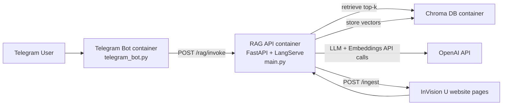

# KazRAGUNIProject

RAG-сервис для ответов на вопросы о InVision U + Telegram-бот, который ходит в API и возвращает ответы пользователю.

## Быстрый запуск

```bash
docker-compose up -d --build
```

После старта один раз запусти индексацию данных сайта в Chroma:

```bash
curl -X POST http://localhost:8000/ingest \
  -H 'Content-Type: application/json' \
  -d '{
    "start_url": "https://www.invisionu.education/ru",
    "max_pages": 30,
    "max_depth": 2,
    "request_timeout": 10,
    "restrict_to_start_path": false
  }'
```

Проверка здоровья API:

```bash
curl http://localhost:8000/health
```

---

## Design Doc

### 1) Что делает система

- Загружает страницы InVision U и разбивает их на чанки.
- Сохраняет чанки в векторную БД Chroma.
- По вопросу пользователя ищет релевантные чанки (retrieval).
- Формирует ответ через LLM (`gpt-4o-mini`) на основе найденного контекста.
- Telegram-бот принимает сообщения и проксирует их в RAG API.

### 2) Как система работает

#### Поток A: Индексация знаний (`POST /ingest`)

1. API запускает краулер со `start_url`.
2. Краулер переходит только по внутренним ссылкам того же домена и того же path-prefix (например, `/ru`).
3. HTML очищается (`script/style/noscript` удаляются), извлекается текст и дедуплицируется.
4. `RecursiveCharacterTextSplitter` режет текст на чанки (`chunk_size=1000`, `chunk_overlap=200`).
5. Чанки дедуплицируются по хешу, эмбеддятся через `OpenAIEmbeddings` и сохраняются в `rag_collection` в Chroma.

#### Поток B: Ответ на вопрос (RAG)

1. Пользователь пишет в Telegram.
2. Бот отправляет `POST` в `RAG_INVOKE_URL` (по умолчанию `/rag/invoke`) с payload `{"input": "..."}`.
3. В API `langserve`-роут вызывает `rag_chain`:
   - Retriever достаёт top-k=6 документов из Chroma.
   - Документы форматируются в контекст.
   - Prompt + вопрос отправляются в `ChatOpenAI`.
   - Результат возвращается строкой.
4. Бот отправляет ответ пользователю в чат.

### 3) Архитектура



### 4) Компоненты

- `main.py`:
  - FastAPI-приложение.
  - `POST /ingest` для загрузки и индексации данных.
  - `GET /health` для healthcheck.
  - `add_routes(..., path="/rag")` для RAG invoke endpoint.
- `telegram_bot.py`:
  - Telegram polling-бот.
  - Читает `TELEGRAM_BOT_TOKEN`.
  - Ходит в `RAG_INVOKE_URL` через `httpx`.
- `docker-compose.yml`:
  - `app` (FastAPI), `chroma` (vector DB), `telegram-bot`.
  - Порядок запуска через `depends_on` + healthcheck.
- `Dockerfile`:
  - Python 3.11 slim, установка зависимостей, запуск `uvicorn`.

### 5) API

- `POST /ingest` — краулинг и индексация данных сайта.
- `GET /health` — статус сервиса.
- `POST /rag/invoke` — запрос к RAG chain (через LangServe).

Пример payload для `POST /ingest`:

```json
{
  "start_url": "https://www.invisionu.education/ru",
  "max_pages": 30,
  "max_depth": 2,
  "request_timeout": 10,
  "restrict_to_start_path": false
}
```

- `restrict_to_start_path=true` — краулить только в рамках path-prefix `start_url` (например, только `/ru/*`).
- `restrict_to_start_path=false` — краулить весь домен (но только внутренние ссылки этого хоста).

### 6) Переменные окружения

- `OPENAI_API_KEY` — ключ OpenAI (обязательно для API).
- `CHROMA_URL` — адрес Chroma для `app` (по умолчанию `http://chroma:8000`).
- `TELEGRAM_BOT_TOKEN` — токен Telegram-бота.
- `RAG_INVOKE_URL` — URL RAG endpoint для бота (в docker-compose: `http://app:8000/rag/invoke`).
- `RAG_TIMEOUT_SECONDS` — timeout запроса бота к API.
